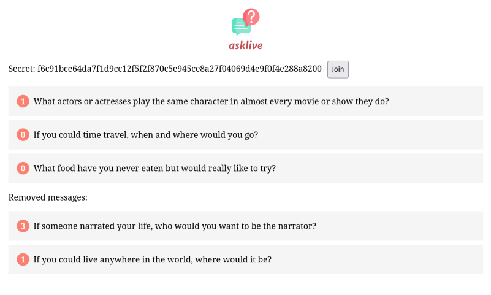

# AskLive

Live Q&A application - ask anonymous questions



## Installing

```bash
pnpm install
```

## Developing

Once you've created a project and installed dependencies with `pnpm install`, start a development server:

```bash
npm run dev

# or start the server and open the app in a new browser tab
npm run dev -- --open
```

## Building

To create a production version of your app:

```bash
npm run build
```

You can preview the production build with `npm run preview`.
